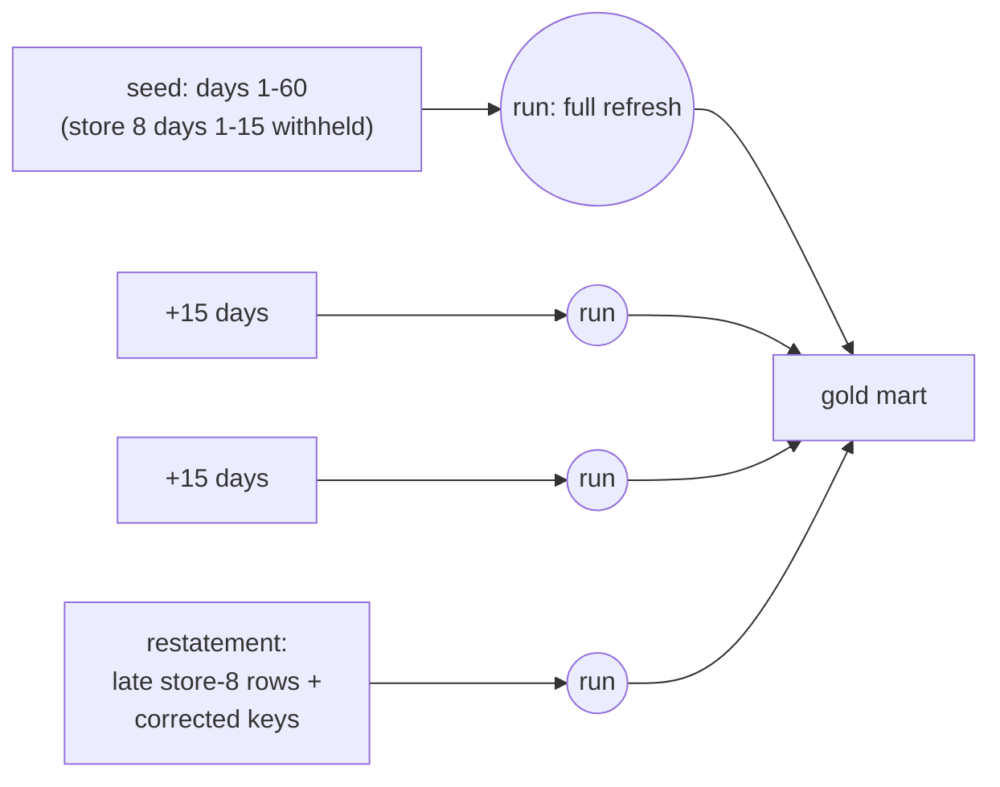

# Incremental Ingestion: Replay Harness

This document describes how NorthMart's medallion pipeline handles **incremental
ingestion**, **late-arriving records**, and **corrected records (restatement)**,
and how to reproduce the demonstration on Databricks Free Edition.

It builds directly on the deploy/run baseline in
[databricks-deploy-run.md](databricks-deploy-run.md).

## The Idea

The bronze tables already use Auto Loader (`spark.readStream` + `cloudFiles`),
which checkpoints the files it has processed. So "incremental" does not require
new ingestion code — it requires **landing data as time-ordered batches** and
re-running the pipeline. Each run, Auto Loader ingests only the *new* files.

We split the static 90-day slice into a seed plus two increments, then add a
final out-of-order **restatement** batch that exercises the two messy realities
every real pipeline faces:

- **Late-arriving:** one store's earliest 15 days are withheld from the seed and
  delivered later, so an already-processed date range gains new rows.
- **Corrected:** a handful of already-published keys are re-emitted with changed
  measures and a higher `batch_seq`, so the newer version must win.



## Design: Append-Only Bronze + Latest-Wins Silver

The key architectural decision is **where restatement happens**:

- **Bronze is an immutable landing log.** Auto Loader appends every row that ever
  landed. A corrected observation appears as an *additional* row for the same
  `(store, product, date)` grain. Bronze therefore holds full history/audit.
- **Silver applies latest-wins.** A shared `latest_raw()` helper ranks rows
  within each `(store_id, product_id, dt)` grain by `batch_seq` (descending,
  with `_loaded_at` as a tiebreak) and keeps only rank 1. Every downstream fact
  and `dim_date` reads through this helper, so corrections and late arrivals
  reconcile in exactly one place.

`batch_seq` is a monotonic load sequence stamped on each landing batch (seed=1,
increments=2/3, restatement=4) and carried in the bronze contract.

### Deliberate trade-off

Bronze ingestion is **incremental** (Auto Loader, append-only streaming tables).
Silver and gold do a **cumulative full recompute** each run (they read the whole
bronze table via `spark.read.table`). At this data size that is correct and
cheap. Truly incremental silver (streaming dedup / `APPLY CHANGES INTO` /
`AUTO CDC`) is a sensible future enhancement, but it adds state-management
complexity that is not justified for the thin slice.

## How to Run

```bash
databricks/scripts/run_replay.sh
```

The harness (env-overridable: `PROFILE`, `TARGET`, `WAREHOUSE_ID`, `CATALOG`):

1. Generates the batch files locally (`python3 -m northmart_data_prep.replay`).
2. Resets the landing folder.
3. Lands masters + the seed batch, then runs the pipeline with
   `--full-refresh-all` to reset checkpoints and tables.
4. Lands each increment and runs the pipeline incrementally.
5. Lands the restatement batch and runs again.
6. Prints verification queries after each stage.

## Observed Results

All four pipeline updates completed on serverless. Verification after the full
replay:

### Cumulative state per stage

| Stage | Bronze landed | Gold rows | Gold max date |
| --- | --- | --- | --- |
| Seed (full refresh) | 37,200 | 37,200 | 2024-04-29 |
| + replay-002-inc | 46,800 | 46,800 | 2024-05-14 |
| + replay-003-inc | 56,400 | 56,400 | 2024-05-29 |
| + restatement | 57,615 | 57,600 | 2024-05-29 |

### Provenance (rows landed per batch in bronze)

| `batch_id` | Rows |
| --- | --- |
| replay-001-seed | 37,200 |
| replay-002-inc | 9,600 |
| replay-003-inc | 9,600 |
| replay-004-restatement | 1,215 |

Total landed = **57,615** (= 57,600 distinct grain + 15 corrected duplicates).

### Late-arriving verified

`NM-STORE-008` rows for `2024-03-01`..`2024-03-15` were absent after the seed and
**1,200 rows** appeared in gold only after the restatement batch — a previously
processed date range correctly gained data.

### Restatement verified

The corrected key `NM-STORE-001 / NM-SKU-00001` shows **both versions in bronze**:

| `batch_id` | `batch_seq` | `sale_amount` | `stock_hour6_22_cnt` |
| --- | --- | --- | --- |
| replay-001-seed | 1 | 2.6065 | 0 |
| replay-004-restatement | 4 | 5.2130 | 8 |

…while **gold keeps only the corrected (latest) version** — `stockout_hours = 8`,
`priority_tier = critical` for `2024-03-06`..`2024-03-08`.

### Grain integrity

`silver.fact_sales` = **57,600 rows with 0 duplicate** `(store, product, date)` —
latest-wins collapses the append-only duplicates back to a clean grain.

## Notes / Gotchas

- `databricks bundle run` runs the **already-deployed** pipeline; re-deploy
  (`databricks bundle deploy`) after changing pipeline source before replaying.
- `--full-refresh-all` reprocesses every file currently in landing, so the seed
  stage lands only the seed before the full refresh; later stages run normally
  so Auto Loader picks up just the newly landed file.
- Verification SQL must not `UNION` a `DATE` with `BIGINT` counts — cast the date
  to `string`.
